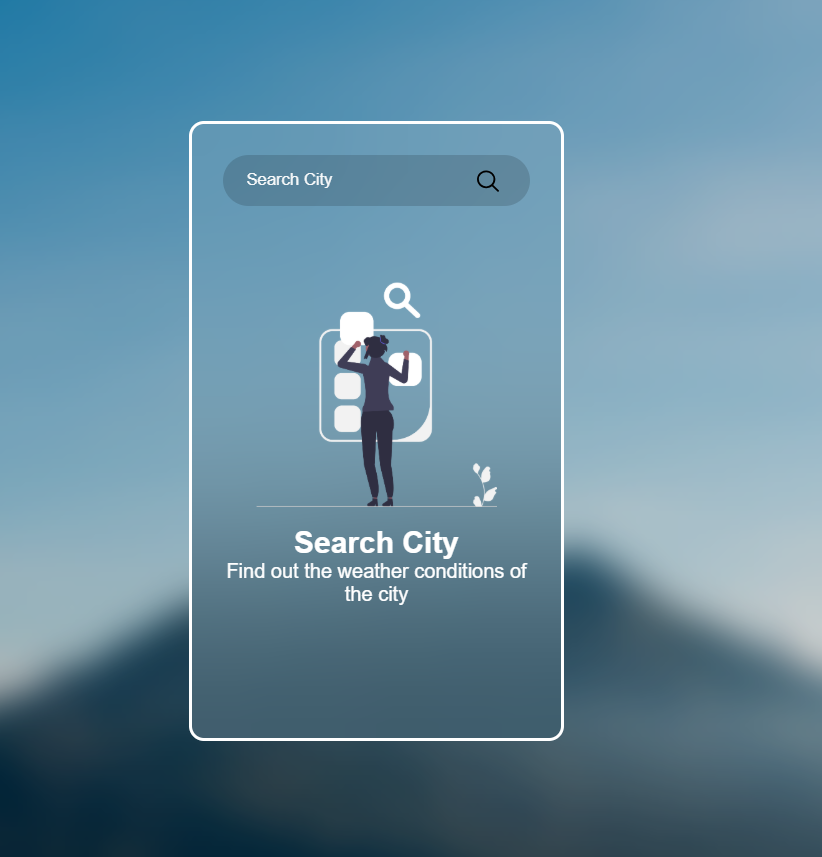
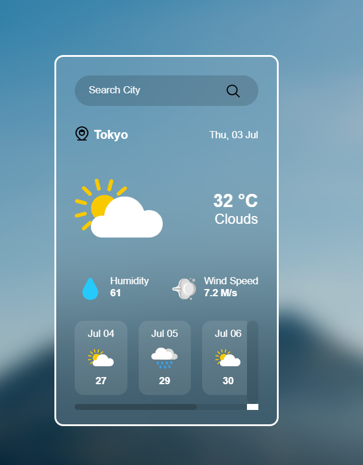

# 🌤️ Weather Web App

A simple weather application built using HTML, CSS, and JavaScript that fetches real-time weather data from the OpenWeatherMap API.

🔗 **Live Demo**: [https://kolawole2.github.io/Weather-Web-App/](https://kolawole2.github.io/Weather-Web-App/)

---

## 📌 Features

- ✅ Get current weather conditions
- 🌦️ View 5-day weather forecasts (12:00PM only)
- 🔍 Search by city name
- 🎯 Displays temperature, wind speed, humidity & weather condition
- 🎨 Responsive UI (custom icons + basic styling)

---

## 🧑‍💻 Technologies Used

- HTML5  
- CSS3  
- JavaScript (ES6)  
- OpenWeatherMap API  

---

## ⚙️ Setup

> Make sure you have a valid OpenWeatherMap API key.

1. Clone the repository:

```bash
git clone https://github.com/Kolawole2/Weather-Web-App.git
```

2. Create a `config.js` file in the root directory:

```js
// config.js
const config = {
  weatherApiKey: "YOUR_API_KEY_HERE"
}
```

> ⚠️ Make sure `config.js` is listed in `.gitignore` to keep your API key private.

3. Open `index.html` in your browser.

---

## 🚀 Deployment

This app is deployed via **GitHub Pages**.  
To redeploy or update it:

```bash
git add .
git commit -m "Updated changes"
git push
```

GitHub Pages will automatically publish the latest version.

---

## 📸 Screenshots




---

## 📄 License

This project is licensed under the [MIT License](LICENSE).

---

## 🙋‍♂️ About Me

I'm Kolawole –  I’m learning to become a software engineer.  
I enjoy building simple web apps and improving my skills every day..  
Follow me on [Twitter](https://twitter.com/BigTRD01) to see more of my work!

---

## ⭐️ Show Your Support

If you found this project helpful, give it a ⭐ on GitHub!
